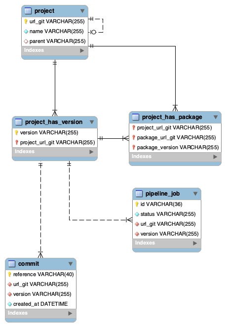

# Repository Database

Schema of the database

### 🖥️ Stack Technology

MySQL 8

Docker

## 🚀 Environment Setup

### 🐳 Needed tools

1. [Install Docker](https://www.docker.com/get-started)
2. Clone this project: `git clone https://github.com/pgrau/repository-db`
3. Move to the project folder: `cd repository-db`

### 🔥 Application execution

1. Install and bring up the MySQL executing:
   `make start`

2. Import the schema into MySQL:
   `make import`

3. Stop MySQL docker container executing:
   `make down`

### 👩‍💻 Database model

[You can see all SQL in the file schema.sql](schema.sql)